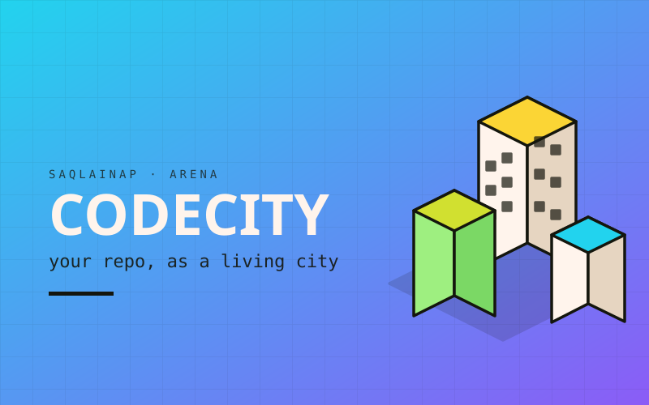
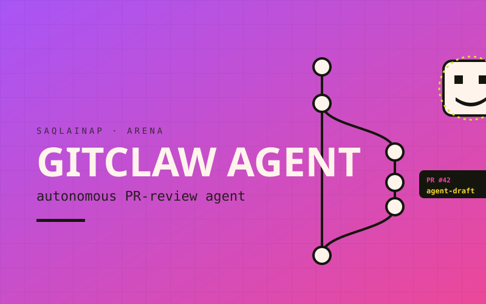
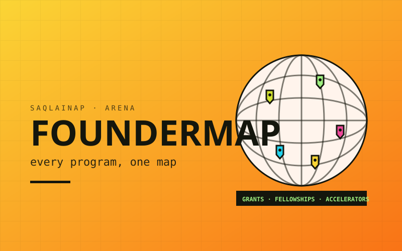
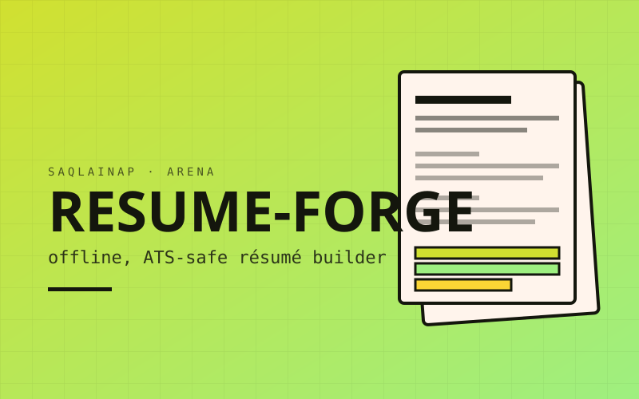
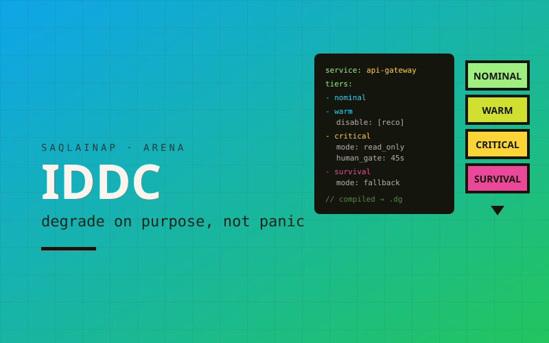
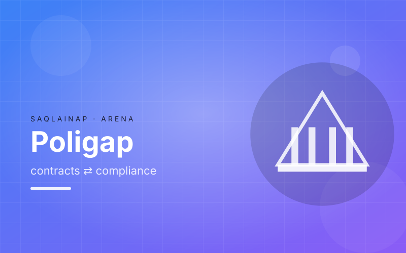

<p align="center">
  <a href="https://saqlainap.github.io/me/">
    
  </a>
</p>

<p align="center">
  <a href="https://saqlainap.github.io/me/">
    
  </a>
</p>

<p align="center">
  <a href="https://saqlainap.github.io/me/"></a>
  <a href="https://www.linkedin.com/in/saqlain-ahmed-p-sap"></a>
  <a href="https://x.com/saqlainahmed302"></a>
  <a href="mailto:302saqlainahmed@gmail.com"></a>
  <a href="https://saqlainap.github.io/me/Saqlain-resume-25.pdf"></a>
</p>

<br />

## ▍`$ whoami`

```bash
saqlain@bangalore:~$ cat about.yml
```

```yaml
name:      Saqlain Ahmed P
role:      Forward Deployed Engineer @ Plivo
education: B.E. Artificial Intelligence & Machine Learning, DSCE Bangalore (2022–2026) · CGPA 9.25
focus:     [voice-ai, rag, agentic-systems, cloud-native, full-stack]
exploring: [web3, iot, cloud-native infra]
wins:      8 hackathons · 1st in debate, seminar & extempore
scholar:   Linux Foundation (2023, 2026) · Google × IBM Quantum (QubitxQubit)
off-duty:  movies · gaming · community meetups
ask-me:    AI · ML · GenAI · DevOps · InfoSec · Data Science
status:    open to collaborations ✦
```

## ▍Now & before

| | Role | Where | When | Highlights |
|:-:|:--|:--|:--|:--|
| 🟢 | **Forward Deployed Engineer** | **Plivo** | Feb 2026 – now | AI IVR platform and agentic query-resolution chatbot · internal RAG knowledge system + n8n automations (**+25%** EDA efficiency) · benchmarked **8 voice AI vendors** on real PSTN calls |
| ⚪ | Product Dev & Engineering Intern | Kroolo AI | Jul – Nov 2025 | Policy analyzer & generator from scratch (**40+ policies, 90%+ accuracy, −40%** review time) · Enterprise Search (**−30%** response time) |
| ⚪ | Prompt Engineering Intern | GetCreatr AI | May – Jul 2025 | Shipped **5 end-to-end AI apps**, **$3,000+** client revenue |

## ▍Featured builds

<table>
  <tr>
    <td width="33%" valign="top">
      <a href="https://github.com/SAQLAINAP/CodeCity"></a><br />
      <a href="https://github.com/SAQLAINAP/CodeCity"><b>CodeCity</b></a><br />
      <sub>Your repo as a living city while an AI agent works on it.</sub><br />
      <sub><code>JS · Canvas · Claude Code hooks</code></sub>
    </td>
    <td width="33%" valign="top">
      <a href="https://github.com/SAQLAINAP/GitClaw-Agent"></a><br />
      <a href="https://github.com/SAQLAINAP/GitClaw-Agent"><b>GitClaw</b></a><br />
      <sub>AI PR reviewer with OTel traces, signed audit log and 5-LLM fallback.</sub><br />
      <sub><code>Node · Anthropic SDK · OTel</code></sub>
    </td>
    <td width="33%" valign="top">
      <a href="https://github.com/SAQLAINAP/FounderMap"></a><br />
      <a href="https://github.com/SAQLAINAP/FounderMap"><b>FounderMap</b></a> · <a href="https://founder-map-six.vercel.app">live ↗</a><br />
      <sub>Global index of grants and accelerators, curated by LLM agents.</sub><br />
      <sub><code>Next.js · Python · Groq</code></sub>
    </td>
  </tr>
  <tr>
    <td width="33%" valign="top">
      <a href="https://github.com/SAQLAINAP/resume-forge"></a><br />
      <a href="https://github.com/SAQLAINAP/resume-forge"><b>Resume-Forge</b></a> · <a href="https://saqlainap.github.io/resume-forge/">live ↗</a><br />
      <sub>Offline, ATS-safe résumé builder with 32 formats.</sub><br />
      <sub><code>React · TS · Capacitor</code></sub>
    </td>
    <td width="33%" valign="top">
      <a href="https://github.com/SAQLAINAP/Intent-Driven-Degradation-Contract"></a><br />
      <a href="https://github.com/SAQLAINAP/Intent-Driven-Degradation-Contract"><b>IDDC</b></a><br />
      <sub>Degradation contracts compiled and enforced at runtime.</sub><br />
      <sub><code>Go · Kubernetes · Prometheus</code></sub>
    </td>
    <td width="33%" valign="top">
      <a href="https://github.com/SAQLAINAP/Poligap"></a><br />
      <a href="https://github.com/SAQLAINAP/Poligap"><b>PoliGap</b></a><br />
      <sub>AI contract and compliance gap analysis with cited clauses.</sub><br />
      <sub><code>FastAPI · Next.js · Portkey</code></sub>
    </td>
  </tr>
</table>

<p align="center">
  <sub>
    also shipped →
    <a href="https://saqlainap.github.io/pishani/">Pishani</a> ·
    <a href="https://github.com/SAQLAINAP/SafeClick">SafeClick</a> ·
    <a href="https://github.com/SAQLAINAP/Architectural-AI-Gemini">Architectural AI</a> ·
    <a href="https://github.com/SAQLAINAP/NewsPod">NewsPod</a> ·
    <a href="https://github.com/SAQLAINAP/Real-Time-Speech-Spam-Detection-System">Speech Spam Detector</a> ·
    <a href="https://github.com/SAQLAINAP/DevGuardian">DevGuardian</a> ·
    <a href="https://github.com/SAQLAINAP?tab=repositories">all repos ↗</a>
  </sub>
</p>

## ▍Toolbox

| | |
|:--|:--|
| **Languages** |  |
| **AI / ML** |  &nbsp; <code>OpenAI</code> <code>Anthropic</code> <code>Gemini</code> <code>Groq</code> <code>n8n</code> <code>ChromaDB</code> |
| **Frontend** |  |
| **Backend** |  |
| **Cloud & DevOps** |  |
| **Data** |  |
| **Design & IoT** |  |

## ▍Wins & recognition

<details open>
<summary><b>🏆 Hackathons: 8 wins</b></summary>
<br />

| Event | Result | When |
|:--|:-:|:--|
| AI Agents Quiz · BTW | 🥇 Winner | Aug 2026 |
| Nano Hackathon w/ GitHub Copilot | 🥇 Winner | Dec 2025 |
| Kaspersky × MAHE Hackathon | 🥇 Winner | Nov 2025 |
| CodeRush · Genesis (DSCE) | 🥇 Winner | Sep 2025 |
| Future of Work × Kroolo Hackathon | 🥇 Winner | Jun 2025 |
| Case-Study Contest · WeSrijan (Welingkar) | 🥇 Winner | Apr 2025 |
| GetCreatr Vibe-Coding Showdown | 🥇 Winner | Mar 2025 |
| Inter-continental AI Agents Hackathon × August AI | 🥇 Winner | Nov 2024 |

</details>

<details>
<summary><b>🎓 Scholarships & startup programs</b></summary>
<br />

- **Shubhra Kar Linux Foundation Scholar** (2023, 2026)
- **Google × IBM × QubitxQubit** Quantum Computing Scholar (2023)
- **AI-ML Campus Scholarship**, DSCE (2023)
- **Algorand India Accelerator**, finalist · **Conquest (BITS Pilani)**, finalist · **Xartup Fellowship**, finalist

</details>

<details open>
<summary><b>📜 Certifications</b></summary>
<br />

<a href="https://ti-user-certificates.s3.amazonaws.com/e0df7fbf-a057-42af-8a1f-590912be5460/9e333afe-60bd-474e-8ff5-6f90d19d5f48-saqlain-ahmed-p-8deae288-6dea-448e-854e-93c09134aae3-certificate.pdf"></a>
<a href="https://certificates.cs50.io/0c311c90-1745-4eeb-977b-a966d5431687.pdf?size=letter"></a>
<a href="https://certificates.cs50.io/5230fd17-8fad-41e2-bb32-5b8711c051f0.pdf?size=letter"></a>
<a href="https://www.freecodecamp.org/certification/Saqlainap/foundational-c-sharp-with-microsoft"></a>

</details>

## ▍GitHub pulse

<p align="center">
  
  
</p>
<p align="center">
  
</p>

## ▍Elsewhere

<p align="center">
  <a href="https://www.hackerrank.com/profile/saqlainahmed3021"></a>
  <a href="https://www.discord.com/users/806500962386051103"></a>
  <a href="https://instagram.com/saqlain_x_ahmed"></a>
  <a href="https://www.facebook.com/saqlain.ahmed.9026040"></a>
  <a href="https://twitch.tv/saqlainap"></a>
  <a href="https://linktr.ee/saqlainap"></a>
</p>

<p align="center">
  
</p>

<p align="center">
  
</p>
