

  

  
  
  <a href="https://x.com/saqlainahmed302"></a>
  
  

  

  

  
  <a href="https://github.com/SAQLAINAP/CodeCity"></a>
  <a href="https://github.com/SAQLAINAP/GitClaw-Agent"></a>
  <a href="https://github.com/SAQLAINAP/FounderMap"></a>
  <a href="https://github.com/SAQLAINAP/resume-forge"></a>
  <a href="https://github.com/SAQLAINAP/Intent-Driven-Degradation-Contract"></a>
  <a href="https://github.com/SAQLAINAP/Poligap"></a>
  <a href="https://github.com/SAQLAINAP?tab=repositories"></a>

  

  

  
  <a href="https://ti-user-certificates.s3.amazonaws.com/e0df7fbf-a057-42af-8a1f-590912be5460/9e333afe-60bd-474e-8ff5-6f90d19d5f48-saqlain-ahmed-p-8deae288-6dea-448e-854e-93c09134aae3-certificate.pdf"></a>
  <a href="https://certificates.cs50.io/0c311c90-1745-4eeb-977b-a966d5431687.pdf?size=letter"></a>
  <a href="https://certificates.cs50.io/5230fd17-8fad-41e2-bb32-5b8711c051f0.pdf?size=letter"></a>
  <a href="https://www.freecodecamp.org/certification/Saqlainap/foundational-c-sharp-with-microsoft"></a>

  

  

  
  
  
  
  
  

  

  

